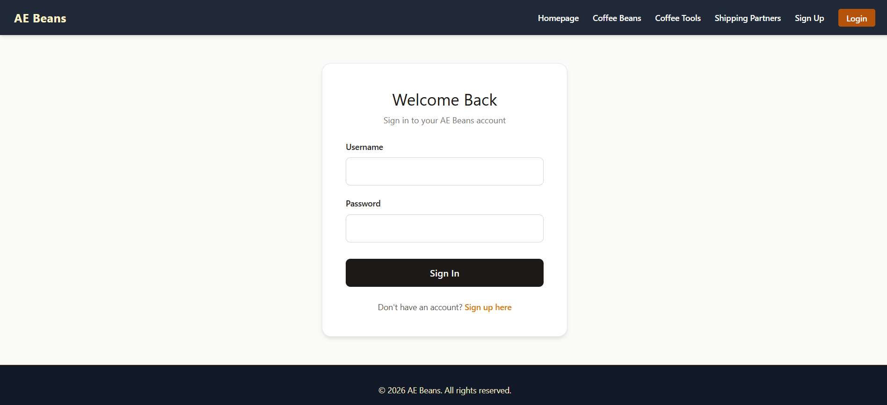
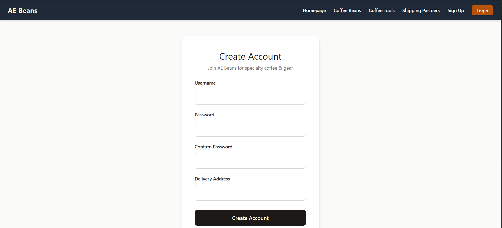
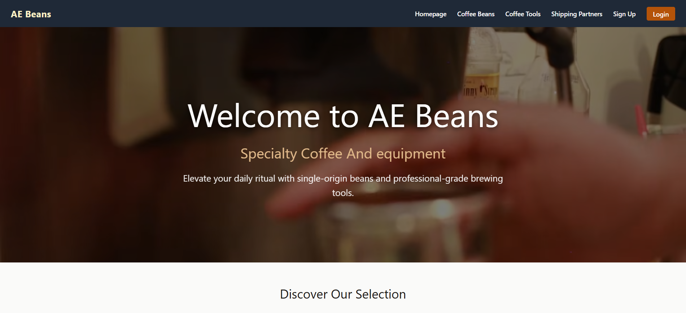
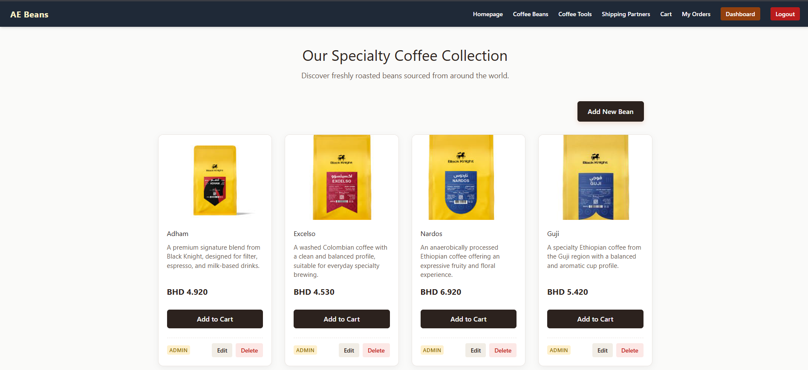
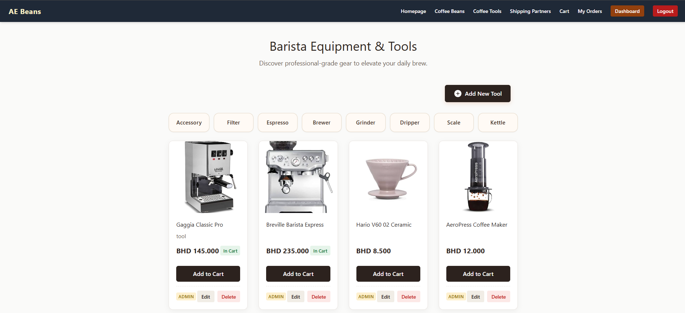
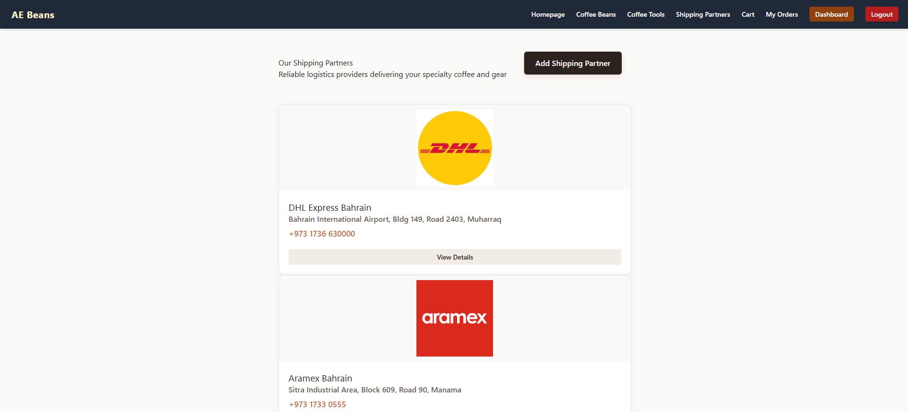
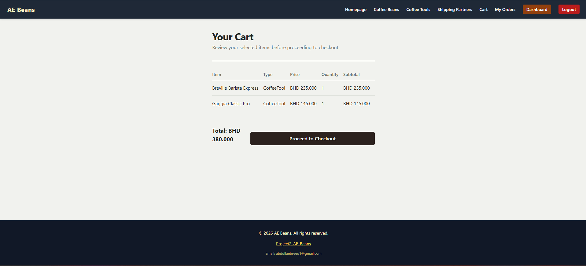
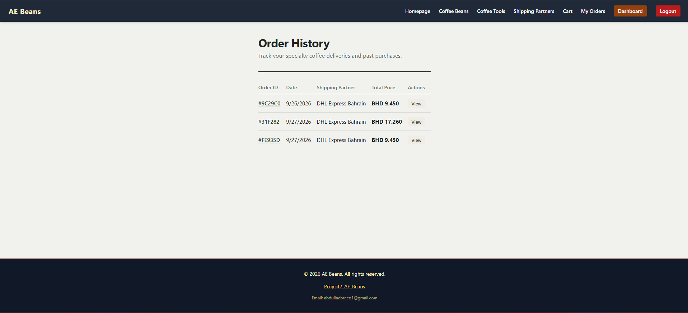
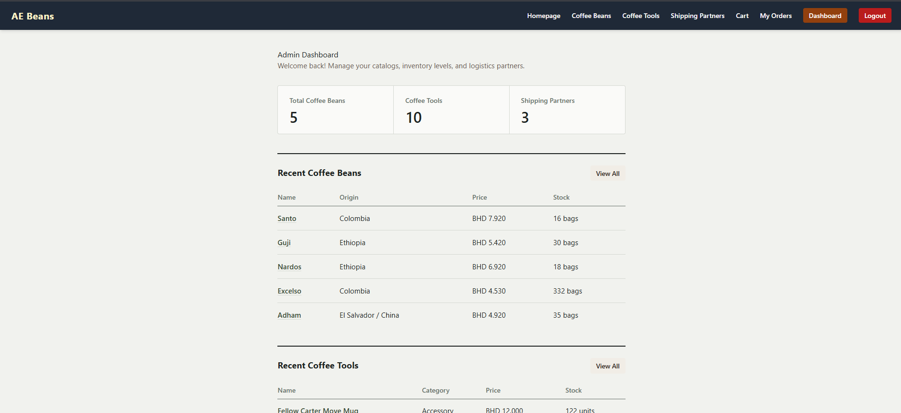

# Project Name

AE Beans

## Overview

A specialized e-commerce platform that bridges specialty coffee roasters/suppliers and customers by offering a curated catalog of Coffee Beans and Coffee Tools, complete with user management, logistics tracking, and order processing.

## Screenshots
### Sign In Page

### Sign Up Page

### Home Page 

### Coffee Beans Page

### Coffee Tools Page

### Shipping Partner Page

### Cart Page

### Orders Page

### Admin Dashboard



## Technologies Used

- CSS
- JS
- EJS
- MongoDB
- Express
- NodeJS

## Getting Started

Follow these steps to clone and run the project locally on your machine.

### 1. Clone the Repository

```bash
git clone [https://github.com/aalebreeq1/ae-beans.git](https://github.com/aalebreeq1/ae-beans.git)
cd ae-beans

```

### 2. Install Dependencies

Install all required Node packages:

```bash
npm i

```

### 3. Configure Environment Variables

Create a `.env` file in the root directory:

```bash
touch .env

```

Add your configuration settings inside `.env`:

```env
PORT=3000
MONGO_URI=mongodb://127.0.0.1:27017/ae-beans

```

### 4. Start MongoDB

Ensure your local MongoDB instance or database service is active and running.

### 5. Run the Application

Start the development server:

```bash
nodemon server.js

```

### 6. View in Browser

Open your browser and navigate to:

```text
http://localhost:3000

```

## User Stories

1. As a customer, I want to login using my username and password.
2. As a customer, I want to view the catalog of active coffee beans and coffee tools.
3. As a customer, I want to place a new order by selecting items and choosing a shipping company.
4. As a customer, I want to view my order history and check my order status.
5. As an admin, I want to access a secure admin dashboard to monitor overall platform activities.
6. As an admin, I want to create, update, and soft-delete coffee beans and coffee tools.
7. As an admin, I want to manage shipping companies by adding, updating, or soft-deleting logistics partners.
8. As an admin, I want to view all system orders and manage their assignment or status.
9. As a shipping company user, I want to access a dedicated shipping dashboard to view deliveries assigned to my company.
10. As a shipping company user, I want to update the delivery progress and status of active orders assigned to me.

## Database Design


## Routes

### Beans Model Routes
| Method | Route               | Description                                                                                      |
| ------ | ------------------- | ------------------------------------------------------------------------------------------------ |
| GET    | `/beans`            | View the catalog list of active coffee beans, with a flag showing which are already in the cart. |
| GET    | `/beans/create`     | View the form to add a new coffee bean (admin only).                                             |
| POST   | `/beans`            | Submit the new bean form data (with image upload) to save it (admin only).                       |
| GET    | `/beans/:id`        | View the details page of a specific bean.                                                        |
| GET    | `/beans/:id/edit`   | View the update form pre-filled with a specific bean's data (admin only).                        |
| PUT    | `/beans/:id/update` | Submit the updated bean data, including an optional new image (admin only).                      |
| DELETE | `/beans/:id/delete` | Trigger the soft delete (`isDeleted: true`) for a bean (admin only).                             |

### Coffee Tools Routes


### Shippign Company Routes


### Orders Routes


## Features

Browse specialty coffee beans and brewing equipment.

Place orders with multiple items and select a shipping partner.

Three user roles: Customer, Admin, and Shipping Company.

Admin Dashboard to manage products, users, orders, and logistics.

Shipping Company Dashboard to view and update delivery statuses.

Safe product archiving using soft deletes (isDeleted).

Built using Node.js, Express, MongoDB, EJS, and CSS.

## Future Enhancements

## Credits
